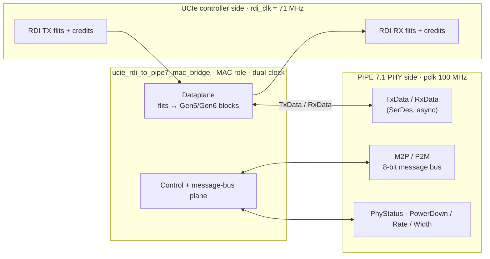
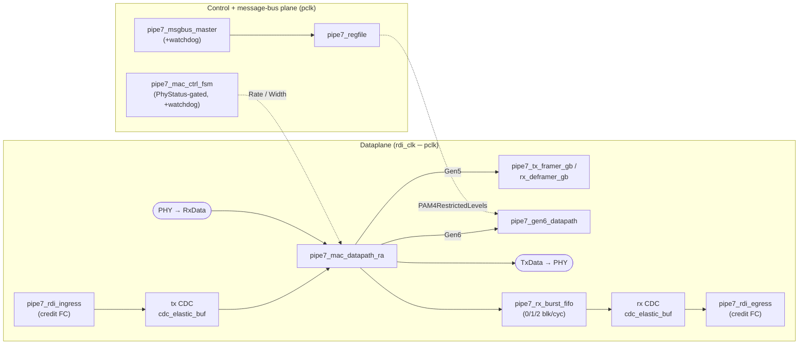

# ucie-rdi-to-pcie6-pipe7

UCIe 1.0 RDI ↔ **PCIe 6.x / PIPE 7.1 MAC-facing** bridge IP (Gen5 + Gen6).

This is a ground-up successor to a UCIe-RDI-to-"PIPE" CDC bridge whose downstream port was
a generic valid/ready stub. Here the PIPE side is a **real PIPE 7.1 MAC-facing interface**:
the bridge plays the MAC/controller role and talks to a PIPE PHY over the **SerDes
Architecture** (async interface with the 8-bit M2P/P2M message bus carrying most
control/status), supporting **Gen5 (32 GT/s, 128b/130b)** and **Gen6 (64 GT/s, PAM4 FLIT)**.

## Status

Integrated IP complete. Execution followed [`PLAN.md`](PLAN.md) as a phased closure plan, one
numbered item per commit. **Item 0 (spec cross-check)** reconciled every placeholder constant
against the controlled Intel PIPE 7.1 specification; the cores (items 1–15) and the **integrated
bridge + all-tier verification** (items 16–25: full-width gearbox, rate-aware datapath, credit-
based UCIe RDI, RDI↔PCLK CDC, the integrated `ucie_rdi_to_pipe7_mac_bridge` top, and the
Verilator / PyUVM / UVM / formal tiers) are delivered, with the Verilator gate green per commit.

## Scope

- **MAC-facing only** — drive MAC-owned signals, react to PHY-owned ones; PHY internals
  (SerDes, PAM4 precoding math, CDR, elec-idle detection) are out of scope.
- **Rates:** Gen5 + Gen6 only (no legacy Gen1–4 ladder).
- **FEC / flit-LCRC:** controller/RDI-side, not implemented at the PIPE interface.

## Architecture

**Architecture block diagram** — the bridge plays the PIPE MAC/controller role between two clock
domains: the UCIe RDI controller side (`rdi_clk`) and the PIPE 7.1 PHY side (`pclk`). Three planes
cross the boundary — a credit-based dataplane, an 8-bit M2P/P2M message bus, and the
PhyStatus-gated control handshake.

**Design block diagram** — the shipped `src/` modules. The dataplane is a credit-gated,
dual-clock pipeline (RDI↔PCLK CDC via `pipe7_cdc_elastic_buf`); the rate-aware datapath muxes the
Gen5 full-width gearbox against the Gen6 raw plane by `Rate`, and a burst FIFO absorbs the
0/1/2-blocks-per-`pclk` RX bursts. The control plane is watchdog-bounded and writes committed
register state through to the Gen6 datapath.

See [`docs/architecture.md`](docs/architecture.md) for the clock-domain, datapath, and
control-plane detail behind these diagrams.

## Verification

**Coverage at a glance** (current baselines; `make report` regenerates them):

| Metric | Tool / engine | Result |
|--------|---------------|-------:|
| DUT line coverage | Verilator, `src/` union across the smoke suite | **651 / 662 = 98.34 %** |
| Functional coverage | `cocotb_coverage` on Icarus (independent engine + tool) | **45 / 45 = 100 %** |
| Formal proofs | SymbiYosys (BMC + cover) | **8 / 8 pass** |
| PyUVM cross-checks | cocotb (Verilator + Icarus) | **5 / 5 pass** |

Two-tier, mirroring the predecessor's methodology:

- **Verilator** — open-source CI gate (`make regress`): lint + the integrated-bridge end-to-end
  smoke (RDI round-trip + control + message bus, assertions bound) plus per-block self-checking
  smokes (control FSM, message bus, Gen5 framing + full-width gearbox, Gen6 datapath, rate-aware
  datapath, RDI credit FC, CDC, protocol SVA), a reduced-config param smoke, and line coverage
  (`make regress_cov`; **DUT** baseline **~98% line (651/662, `src/` union across the smoke suite)** on the integrated bridge).
- **PyUVM-on-Cocotb** — runnable cross-check (`make cocotb`, a required CI gate): independent
  Python models cross-check the datapath, control plane, and message bus, **plus the integrated
  bridge end-to-end** (`test_bridge.py`, 3-way) and a **Gen6-wide RX** check (`test_gen6_rx.py`).
- **Independent coverage** — a redundant cross-check to the Verilator line gate, independent on
  three axes: engine (**Icarus Verilog**, `make cocotb_icarus` / `make fcov`), tool
  (**`cocotb_coverage`**, pure-Python), and metric (functional bins). Both engines compile the
  identical shipped `src/` RTL (no `sv2v`). `make fcov` scores a spec-derived model and gates
  **≥98%** — current baseline **45/45 = 100% functional coverage** on Icarus, surfaced beside the
  Verilator line union in `make report`.
- **Performance & KPIs** — `make report` aggregates throughput/latency/utilization/occupancy
  (from a bound `pipe7_perf_monitor`) + DUT coverage + smoke/formal/cocotb status into
  `report/{metrics.json, report.md, report.html}`; `make report_check` gates them against
  `scripts/report_thresholds.json` (advisory). Baselines: TX-util ~20%, ~2.6 Gbit/s eff,
  round-trip ~330 ns, zero in-envelope overflow. (Simulation figures, not silicon timing.)
- **Formal (SymbiYosys)** — `make formal`: eight BMC + cover proofs — CDC-buffer invariants
  (single-clock + a true **dual-clock multiclock** proof on the real RTL), RDI credit-FC on both
  the egress and ingress sides, the Gen5 gearbox accept/accumulator bounds, the rate-aware datapath
  control (TxElecIdle gating, rate-mux exclusivity, data-phase-only-from-P0), and the RX deframer
  overflow guard (re-model **and** bound to the shipped RTL via the yosys-slang frontend).
- **UVM (VCS/UVM 1.2)** — authored-and-review-validated growth path (`make uvm`), retargeted at
  the integrated bridge (credit/flit RDI, dual-clock) with a **Gen6-wide RX** agent + mirrored-
  queue scoreboard, alongside the control/message-bus agents, PHY-responder BFM, and covergroups.

See [`docs/`](docs/) and [`PLAN.md`](PLAN.md) for architecture, interface contract, and the
verification plan.

## Build / developer workflow

`make` (no target) prints a grouped list of targets. Common ones:

- `make regress` — release gate (lint + every Verilator smoke).
- `make cocotb` — Tier 1b PyUVM-on-Cocotb cross-checks (datapath + control-plane + message-bus).
- `make waves WAVE_TB=framing|ctrl|msgbus|gen6|assn` — build+run a testbench with tracing to
  `waves/<tb>.vcd`; `make gtkwave WAVE_TB=...` opens it in GTKWave with the saved
  [`waves/<tb>.gtkw`](waves/) signal layout.
- `make ci` — the full local run (regress + coverage + NL1 + docs check).
