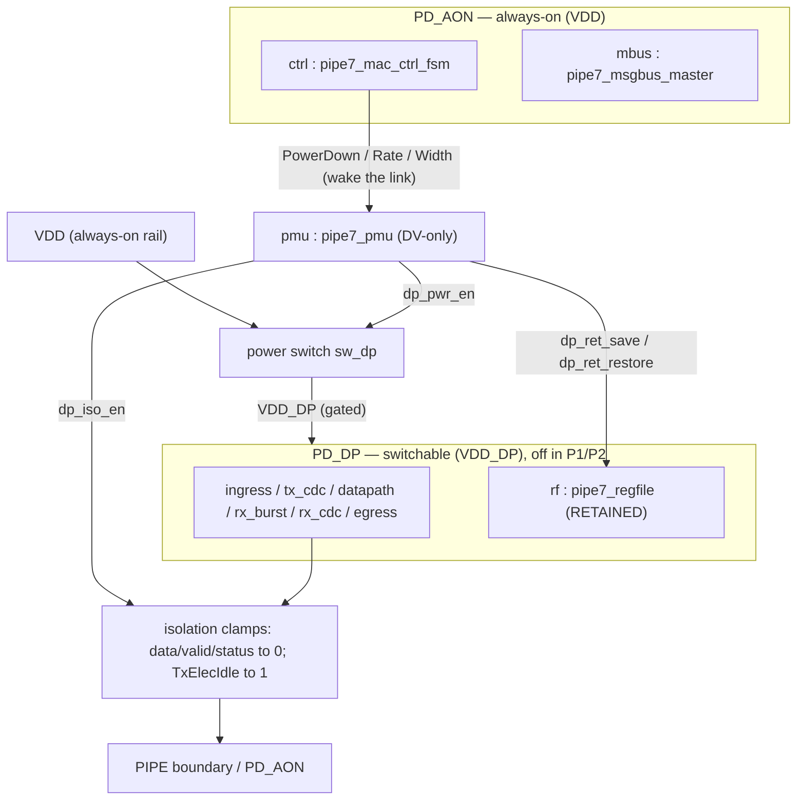

# Power intent — UCIe RDI → PIPE 7.1 MAC bridge

Power-domain architecture and low-power verification for `ucie_rdi_to_pipe7_mac_bridge`,
expressed as IEEE-1801 **UPF** and exercised by an authored power-aware test.

> **Tooling reality.** No open-source simulator here models UPF/CPF power semantics
> (Verilator/Icarus/Yosys do not implement supply/isolation/retention/corruption). Power-aware
> simulation requires a commercial engine (VCS NLP `-upf`, Questa PA, Xcelium). The UPF + test
> therefore live in `test/upf/` as an **authored-and-review-validated** tier — same status as the
> Tier-2 UVM env — not part of the Verilator `make regress` gate. UPF is used rather than CPF
> (CPF is legacy/Cadence-only).

## Why power intent at all — and what's *not* a power domain

The bridge's `PowerDown[3:0]` / P0·P0s·P1·P2 signalling is the **PIPE *protocol*** the MAC drives
to the PHY — functional logic, **not** physical supply domains. UPF adds the *physical* power
architecture an SoC integration would impose on this IP, and ties it to those protocol states: the
datapath is physically gated in the deep low-power states while the control plane stays alive to
bring the link back.

## Domain partition

The bridge RTL is scope-locked and has no power-control ports, so the switch/isolation/retention
controls come from the sibling **`pmu`** instance (a DV-only sequencer, `test/upf/pipe7_pmu.sv`)
that decodes the PIPE `PowerDown` state the bridge already drives.

| Element | Domain | Reason |
|---------|--------|--------|
| `ctrl` (control FSM) | `PD_AON` | must sequence the PowerDown/Rate/Width → PhyStatus handshakes that **exit** low power; cannot be gated by the state it has to leave |
| `mbus` (message-bus master) | `PD_AON` | register access / status must remain live while the datapath is down |
| datapath: `ingress`, `tx_cdc`, `datapath`, `rx_burst`, `rx_cdc`, `egress` | `PD_DP` | carries no traffic in P1/P2 → gate it for leakage savings; state is **transient** (re-locks on wake, no retention) |
| `rf` (config register file) | `PD_DP`, **retained** | programmed PHY-Tx-Control / `PAM4RestrictedLevels` must survive low power; retaining the small bank beats paying always-on leakage for it |

## Strategies (see `test/upf/bridge.upf`)

- **Power switch** `sw_dp`: `VDD → VDD_DP`, ON when `pmu/dp_pwr_en`.
- **Isolation** on `PD_DP` outputs, enabled by `pmu/dp_iso_en`: default clamp `0`; **`TxElecIdle`
  clamps `1`** so the PHY sees asserted electrical idle while the datapath is powered down.
- **Retention** on `rf`, save/restore via `pmu/dp_ret_save` / `pmu/dp_ret_restore`, balloon latches
  on `SS_AON`.
- **Sequencing** (in `pipe7_pmu.sv`): down = isolate → save → gate; up = ungate → restore →
  de-isolate. Ordered so no corrupt datapath value reaches the always-on domain.

## Power state table

| PIPE PowerDown | `VDD` (AON) | `VDD_DP` (datapath) | Notes |
|----------------|-------------|---------------------|-------|
| P0 (normal)    | ON | ON  | full operation |
| P0s (fast idle)| ON | ON  | fast-recovery; datapath kept powered |
| P1 (deep)      | ON | OFF | datapath gated; control plane alive |
| P2 (lowest)    | ON | OFF | datapath gated; control plane alive |

## Verification

`test/upf/tb_pipe7_upf_power.sv` runs P0 → P2 → P0 and checks, under `vcs -upf`
(`+define+UPF_POWER_AWARE`):

1. **Isolation** — while gated, `TxDataValid` reads `0`, `TxElecIdle` reads `1`, and no `TxData`
   X-corruption leaks past isolation.
2. **Control liveness** — a message-bus transaction still completes while `PD_DP` is off.
3. **Retention** — the config value programmed before P2 is intact after wake.
4. **Datapath recovery** — traffic round-trips again after the (non-retained) datapath re-locks.

The same TB builds under Verilator without the define as a **skeleton** check (`make verilator_upf`)
that keeps the RTL/TB wiring green; it does not exercise power intent.
