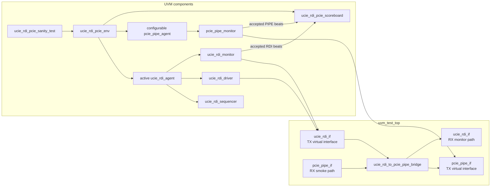
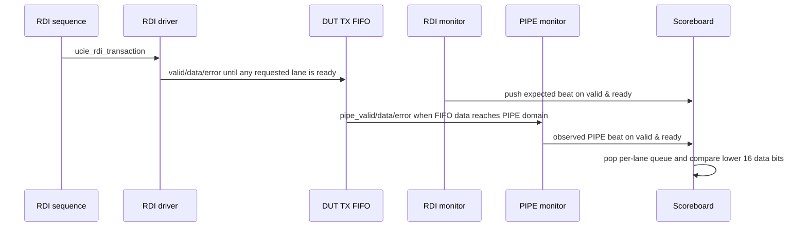

# UVM verification guide

This guide describes the UVM environment in `test/uvm/` as it exists in this repository. It is intended to help verification owners extend the environment without confusing it with the Verilator smoke testbench, which remains the current release gate.

## Current scope

| Area | Current UVM status | Notes |
|------|--------------------|-------|
| Simulator target | Synopsys VCS | Driven by `test/uvm/Makefile.vcs` with `-ntb_opts uvm-1.2`. |
| DUT parameters | 4 lanes, 16-bit RDI, 32-bit PIPE, FIFO depth 16 | Lane/data geometry is centralized as parameters in `ucie_rdi_pcie_pkg` (`NUM_LANES`, `RDI_DATA_WIDTH`, `PIPE_DATA_WIDTH`, derived `RDI_BUS_WIDTH`/`PIPE_BUS_WIDTH`). Transaction widths, scoreboard loops/slices, and coverage sample ports derive from these, and `uvm_test_top` passes the same values into the interfaces and DUT. Fixed stimulus vectors in `seq_lib` and covergroup bins remain 4-lane specific. |
| TX path (`RDI -> PIPE`) | Stimulated and scoreboarding enabled | Active RDI agent drives requests; passive PIPE monitor observes accepted beats. |
| RX path (`PIPE -> RDI`) | Wired with passive monitors and a smoke RX driver, with basic checking | `uvm_test_top` instantiates RX interfaces, binds passive RX monitors, and the sanity test now runs a small PIPE RX sequence through `pipe_rx_agent`. |
| CRC | Enabled for the smoke sequence | `uvm_test_top` now toggles `crc_enable` for a lane-0 CRC smoke run and mirrors the residue check. |
| Backpressure | PIPE TX ready is agent-controlled in the sanity test | The backpressure sequence drives `ready` low/high/low/high with longer stalls. A deep backpressure sequence paired with an all-lane FIFO-fill now drives **every** lane's TX FIFO to full (`rdi_flow_ctrl` on all lanes) and holds the driver under stall, then releases so the scoreboard proves in-order lossless drain. |
| Assertions | Compiled and active in the UVM top | CDC monitor/statistics now run in both the UVM flow and the non-UVM regression. |

## UVM block diagram



## Transaction flow



The monitor and scoreboard operate per accepted beat, not per raw cycle. Because RDI and PIPE are asynchronous, matching is queue-based by lane rather than cycle-based.

## Component map

| File | Component | Role |
|------|-----------|------|
| `test/uvm/uvm_test_top.sv` | `uvm_test_top` | Generates clocks/reset, instantiates interfaces and DUT, binds virtual interfaces with `uvm_config_db`, starts UVM. |
| `test/uvm/ucie_rdi_if.sv` | `ucie_rdi_if` | RDI TX/RX signal bundle with driver and monitor clocking blocks. |
| `test/uvm/pcie_pipe_if.sv` | `pcie_pipe_if` | PIPE TX/RX signal bundle with driver and monitor clocking blocks. |
| `test/uvm/ucie_rdi_pcie_pkg.sv` | transaction classes | RDI and PIPE sequence items whose widths derive from the package parameters (`NUM_LANES`, `RDI_DATA_WIDTH`, `PIPE_DATA_WIDTH`). |
| `test/uvm/ucie_rdi_pcie_pkg.sv` | `ucie_rdi_driver` | Drives RDI TX `valid`, `data`, and `error` through `ucie_rdi_if.drv_cb`. |
| `test/uvm/ucie_rdi_pcie_pkg.sv` | `ucie_rdi_monitor` | Publishes RDI TX transactions when at least one lane completes `valid & ready`. |
| `test/uvm/ucie_rdi_pcie_pkg.sv` | `pcie_pipe_monitor` | Publishes PIPE TX transactions when at least one lane completes `valid & ready`. |
| `test/uvm/ucie_rdi_pcie_pkg.sv` | `ucie_rdi_pcie_scoreboard` | Maintains one expected queue per lane and compares observed PIPE beats against RDI expectations. |
| `test/uvm/seq_lib/ucie_rdi_seq_lib.sv` | sequence library | Provides single-lane, all-lane, error, and repeated lane-1 traffic sequences. |

## Sequence and coverage intent matrix

| Sequence | Stimulus | Intended check | Current checking strength |
|----------|----------|----------------|---------------------------|
| `ucie_rdi_single_lane_seq` | One lane-0 beat with `data == 64'hDEAD` | Basic lane-0 TX transport | Lower 16 bits and zero-extended upper half on lane 0. |
| `ucie_rdi_multi_lane_seq` | One all-lane beat with lane-specific 16-bit words | Lane packing and independent per-lane queueing | Same per lane with observed PIPE handshake. |
| `ucie_rdi_error_seq` | Lane-2 valid with `error[2] == 1` | Error propagation | **Error bit compared** on observed PIPE beats (with data/zero-extension checks). |
| `ucie_rdi_flow_ctrl_seq` | Thirty-two lane-1 beats | Repeated traffic through FIFO | Data order checked if PIPE accepts all beats; paired with a backpressure sequence in the sanity test. |
| `ucie_rdi_fifo_full_seq` | 24 all-lane beats, per-lane distinct incrementing payloads | TX FIFO-full / hold-under-stall on every lane | Paired with `pcie_pipe_deep_backpressure_seq`; scoreboard `check_phase` asserts `rdi_flow_ctrl` reached all lanes (FIFO full) and all beats drained in order. |
| `pcie_pipe_deep_backpressure_seq` | PIPE ready low 128 cycles then high 400 cycles | Deep stall long enough to fill all TX FIFOs, then full drain | Drives the FIFO-full condition consumed by `ucie_rdi_fifo_full_seq` and the scoreboard occupancy check. |
| `ucie_rdi_crc_seq` | Two lane-0 beats with CRC enabled | CRC residue smoke | `crc_enable[0]` is asserted around the sequence and the UVM top mirrors the residue compare. |
| `pcie_pipe_backpressure_seq` | PIPE ready low/high/low/high | PIPE stall / release behavior | Drives `ready` low for 48 cycles, releases for 16, reasserts low for 16, then releases for 24. |
| `pcie_pipe_rx_seq` | PIPE RX valid/data/error beats | PIPE -> RDI conversion and ordering | Mirrored RX queueing checks lower-half data and error propagation on accepted RX beats. |
| `pcie_pipe_rx_single_lane_seq` | One lane-0 RX beat (`0xBEEF`) | Basic reverse-path transport | Mirrored RX queue checks lane-0 lower-half data. |
| `pcie_pipe_rx_error_seq` | Lane-1 RX beat with `error[1]` | Reverse-path error propagation | Mirrored RX queue checks lane-1 data and error bit. |
| `pcie_pipe_rx_burst_seq` | Four back-to-back lane-0 beats, incrementing payload | Reverse-path FIFO ordering | Mirrored RX queue verifies in-order delivery of the four payloads. |
| `pcie_pipe_rx_rand_seq` | 12 constrained-random RX beats (valid != 0, random data/error) | Reverse-path robustness under varied traffic | Mirrored RX queue self-checks each accepted beat against the observed PIPE RX input. |
| `ucie_rdi_rx_backpressure_seq` | `rdi_rx_ready` low/high/low/high | Reverse-path FIFO backpressure and hold-under-stall | Runs concurrently with `pcie_pipe_rx_rand_seq`; queues must drain once ready is released. |

## Scoreboard contract

| Expected behavior | Current implementation | Gap to close |
|-------------------|------------------------|--------------|
| Accepted **RDI** lane handshake creates one expected queue entry | `write_rdi()` pushes when `tr.valid[i] && tr.ready[i]` (monitor emits on full-beat handshakes) | None for TX enqueue semantics. |
| Accepted **PIPE** lane handshake consumes one expected entry | `write_pipe()` pops when `tr.valid[i] && tr.ready[i]` | None for TX dequeue semantics. |
| RDI 16-bit data zero-extends into PIPE 32-bit data | Lower **and upper** 16 PIPE bits checked vs. zero-extension | None for width check on expectations driven from RDI. |
| Error bit propagates from RDI to PIPE | `write_pipe()` compares `tr.error[i]` vs. stored expectation | None for lanes exercised by sequences. |
| End-of-test drains all TX expectation queues | `check_phase` reports `SB_DRAIN` if any `tx_exp_q[i]` non-empty | RX path / system-level closure still open. |
| FIFO-full is actually reached when armed | Cycle-accurate `write_fc()` (from the TX RDI monitor's `fc_ap`, not the handshake-gated beat path) tracks peak per-lane `flow_ctrl`; `check_phase` reports `SB_FIFO_FULL` if `expect_fifo_full` is set but not all lanes went full | None for TX FIFO-full observability. |

## Recommended UVM closure plan

| Priority | Work item | Why it matters |
|----------|-----------|----------------|
| 1 | Make transaction widths parameter-aware or centralize lane/data constants in a config object | **Delivered (centralization):** lane/data geometry lives in `ucie_rdi_pcie_pkg` parameters that drive the transaction widths, scoreboard slicing, coverage sample ports, and (via `uvm_test_top`) the interface/DUT instantiations. Remaining for a `NUM_LANES` sweep: generalize `seq_lib` stimulus vectors and covergroup bins. |
| 2 | Extend scoreboard for RX path and full-system checks | TX path: **delivered** — per-lane `valid & ready` queueing, upper 16-bit zero check, error compare, and `check_phase` TX queue drain. RX path now has smoke-driver/queueing scaffolding. |
| 3 | Expand PIPE backpressure coverage and decouple passive vs. active ready control | **Delivered.** The TX RDI monitor now publishes a cycle-accurate flow-control stream (`fc_ap`) that is *not* gated on the `valid & ready` handshake — necessary because `rdi_ready` and `rdi_flow_ctrl` are per-lane complements, so a full lane never produces a handshake beat. `ucie_rdi_fifo_full_seq` + `pcie_pipe_deep_backpressure_seq` drive every lane's TX FIFO to full; `cg_occupancy` (now fed from `fc_ap`) reaches its partial/all-lanes bins, and the scoreboard's `SB_FIFO_FULL` check proves the full condition was reached with in-order lossless drain. |
| 4 | Expand RX path sequences and mirrored RDI RX scoreboard | **Delivered.** The sanity test runs single-lane, error, and 4-beat burst RX sequences plus 12-beat constrained-random RX traffic (`pcie_pipe_rx_rand_seq`) driven concurrently with RDI RX backpressure (`ucie_rdi_rx_backpressure_seq`), all checked by the mirrored RX scoreboard. RX backpressure is enabled by a new `ctrl` clocking block on `ucie_rdi_if` and a `ucie_rdi_ready_driver`/sequencer in the env that stalls and releases `rdi_rx_ready`. |
| 5 | Extend functional coverage to RX/TX direction, FIFO occupancy, width conversion, and CRC enable | **Delivered.** `ucie_rdi_pcie_coverage` samples: RX direction (`cg_rx_pipe`, `cg_rx_rdi`); width conversion (`cg_pipe_width` — zero-extension of the PIPE upper half plus lane-0 payload magnitude buckets); FIFO occupancy (`cg_occupancy` — `$countones(rdi flow_ctrl)` as an observable proxy for near-full elastic buffers, since true FIFO depth is internal); and CRC enable/error (`cg_crc`), routed to the TX PIPE monitor via new observation-only `crc_enable`/`crc_error` signals on `pcie_pipe_if`. |
| 6 | Add a CRC predictor and broaden CRC coverage | Current smoke coverage validates the lane-0 residue path, but the model is still only a top-level checker. |

## Run commands

From `test/uvm/`:

```bash
make -f Makefile.vcs compile
make -f Makefile.vcs run
make -f Makefile.vcs run UVM_TESTNAME=ucie_rdi_pcie_sanity_test
make -f Makefile.vcs pdf
make -f Makefile.vcs clean
```

The UVM flow requires a licensed VCS installation with UVM 1.2 support. The repository's open-source CI path uses Verilator and does not compile UVM.
